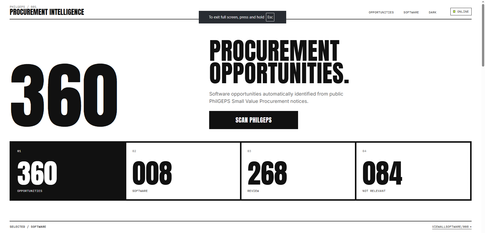

# PhilGEPS Procurement Intelligence

[](https://nodejs.org/)
[](https://expressjs.com/)
[](https://react.dev/)
[](https://vite.dev/)

**PhilGEPS Procurement Intelligence** is a local tool for public [PhilGEPS](https://philgeps.gov.ph) Small Value Procurement notices. It keeps software-related opportunities, reads their public documents, and opens a review page for the rest. Built as a personal project — clone, run locally, and extend.

**Stack:** Node.js · Express · React · Vite · PDF, DOCX, and spreadsheet extraction · OCR for scanned pages

**My role:** Notice scanning and classification, document extraction, the review API, and the React review interface (opportunity index, filters, search, and pagination).

**Author:** [John Solomon M. Alvarez](https://github.com/johnalvaprojects)

## Preview




---

## Quick start

Requires **Node.js 22**.

```bash
npm install
npm test
npm run dev
```

In a second terminal:

```bash
cd frontend
npm install
npm run dev
```

The API listens on `http://localhost:3000`. The review page is the Vite app, usually `http://localhost:5173`, and it proxies `/api` to that server.

Copy `.env.example` to `.env` if that file is missing. `.env` is not committed. Downloaded documents, scan logs, and saved notice files stay in `data/` and are not committed either.

---

## Features

- Scans public Small Value Procurement notices and separates software, review, and not-relevant titles
- Reads PDF, DOCX, and spreadsheet attachments, and uses OCR when a PDF has no text layer
- Review page with search, classification filters, and pagination
- Separate work status for software opportunities: new, in progress, and done, kept across later scans
- Manual mark for software, not relevant, or keep for review
- Dark mode and a hold-to-scan control on the main page

---

## Project layout

| Path | Role |
|------|------|
| `src/` | Scanner, classifier, document extraction, and Express API |
| `frontend/` | React + Vite review interface |
| `config/relevance.json` | Words used to judge software and hardware titles |
| `tests/` | Node test runner checks |
| `data/documents/` | Original downloaded files (local only) |
| `data/output/` | Saved notice JSON and the review page (local only) |

---

## Commands

```bash
npm install
npm test
node src/index.js 85876
node src/index.js https://philgeps.gov.ph/Indexes/viewLiveTenderDetails/85876
node src/index.js --scan
node src/index.js --svp 5
node src/index.js --reclassify
node src/index.js --list
node src/index.js --review
node src/index.js --decide 87086 software
node src/index.js --reviewed 85876
```

`--scan` checks Small Value Procurement notices whose PhilGEPS publish date is from three days ago through today. A hardware title is skipped. A software title, or an unclear title whose document is software, keeps its public attachments in `data/documents/<notice id>/`. An existing file is not overwritten.

`--svp 5` is the short test. It processes at most the number you pass. Every notice counts, including hardware, software, unclear, already saved, and errors. The script waits about one second between requests.

`--reclassify` reads notices already in `data/output` and applies the current classifier again. It does not start a new scan. A manual classification is left unchanged.

`--list` writes `data/output/review.html`. `--review` serves that page on this computer. `--decide` stores a manual decision on the notice JSON. `--reviewed` marks a notice checked and keeps the first reviewed time.

This tool does not create a quotation, choose prices, submit a bid, or contact the agency.

## Output

- `data/output/<id>.json` — one notice, its documents, relevance, and requirements
- `data/output/<id>.extracted.txt` — text read from the PDF
- `data/documents/<id>/` — the original downloaded file, plus `metadata.json` when the notice is kept
- `data/logs/` — one log file for each scan
- `data/output/svp-batch.json` — the short list from a batch run
- `data/output/review.html` — the saved notices as a page

A field that is not in the notice or the document is `null` or an empty list. When a PDF has no text layer, OCR runs and stops after 15 seconds by default (`OCR_TIMEOUT_MS`). The notice is then marked for review. OCR can miss or mix up words, so `usedOcr` is recorded and the original file should still be checked.

---

## License

Licensed under the [MIT License](LICENSE).
