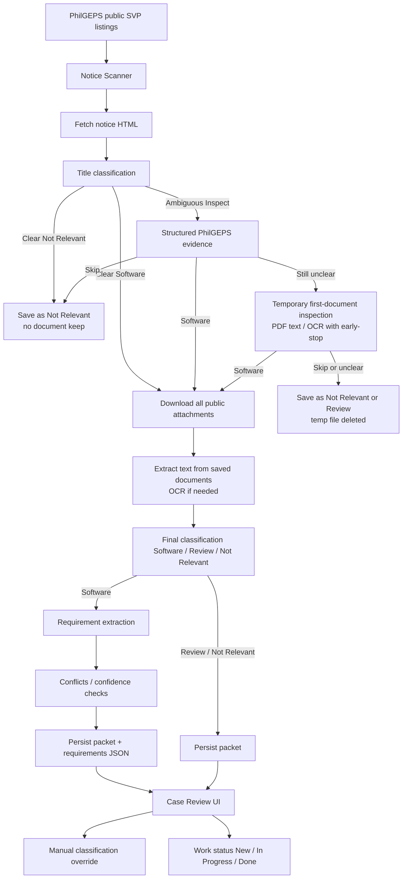
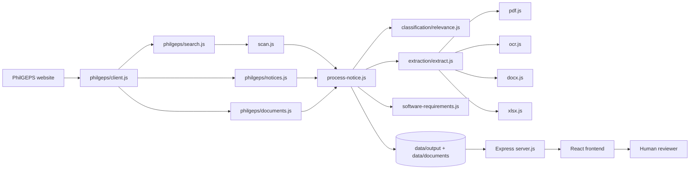

# PhilGEPS Procurement Automation

## Project Documentation

**Audience:** IT Director / technical management  
**Scope:** Actual current codebase (checkpoint as of documentation generation)  
**Repository:** PhilGEPS Procurement Intelligence (Node.js + React)

> This document describes **what the system does today**. Optional future ideas are isolated in Section 21 and are **not** implemented.

---

### 1. Executive Summary

PhilGEPS Procurement Automation is a local software tool that monitors public Small Value Procurement (SVP) notices on the Philippine Government Electronic Procurement System ([PhilGEPS](https://philgeps.gov.ph)).

**Problem it solves:** Staff otherwise spend significant time opening many notices, discarding irrelevant procurements (hardware, catering, civil works, etc.), downloading software-related attachments, and manually copying requirements into quotation work. That process is slow, inconsistent, and easy to miss under time pressure.

**What the system does:**

1. Scans recent public SVP notices.
2. Classifies each notice as **Software**, **Review**, or **Not Relevant** using progressive evidence (title → PhilGEPS structured fields → document inspection/OCR only when needed).
3. Downloads and stores public documents for software opportunities.
4. Extracts structured procurement requirements (items, quantities, license terms, delivery, deadlines, technical specs) with **source provenance**.
5. Surfaces conflicts and low-confidence OCR values for human review instead of guessing.
6. Presents opportunities in a React review interface with case detail, manual classification overrides, and software work-status tracking.

**What it does not do:** It does not choose vendors, match commercial SKUs, price products, generate quotations, or submit bids. Human verification remains intentional before any commercial action.

---

### 2. Project Objectives

Objectives supported by the **current** project:

| Objective | How it is met today |
|-----------|---------------------|
| Automate PhilGEPS SVP notice collection | Scan over a publication-date window; optional limited SVP batch |
| Reduce irrelevant notices | Rule-based relevance classifier with hardware/non-software rejection |
| Identify software opportunities | Software classification from title, structured fields, and documents when needed |
| Retrieve relevant documents | Public attachment download into `data/documents/<id>/` for software cases |
| Extract procurement requirements | Provenance-aware `*.requirements.json` for software notices |
| Flag uncertainty / conflicts | Conflicts, OCR email candidates, and `needs_review` extraction status |
| Centralize human review | React UI: lists, filters, case detail, classification, work status |
| Keep manual control | Manual classification overrides automatic results; work status is operator-driven |

---

### 3. Scope

#### In scope (implemented)

- PhilGEPS public SVP notice scanning (default: last three Manila calendar days through today; optional custom date range via API)
- Relevance classification: Software / Review / Not Relevant
- Progressive document inspection and OCR fallback for ambiguous cases
- Permanent storage of software notice documents
- PDF / DOCX / XLSX text extraction
- Software procurement requirement extraction with provenance
- Conflict detection (e.g. deadlines, ABC financial scopes)
- Human review UI (dashboard, lists, case detail)
- Manual classification and software work-status tracking
- CLI and HTTP API for local operation
- Automated regression tests

#### Out of scope / not currently implemented

- Automatic vendor or product selection
- Automatic product / SKU matching
- Automatic live pricing or ABC quotation math
- Automatic quotation generation or submission
- Autonomous purchasing decisions
- Login to PhilGEPS merchant/Bid Match features
- Old PhilGEPS site support

Human verification of software cases remains a designed step, not a temporary gap.

---

### 4. High-Level Workflow



#### Stage notes (actual implementation)

| Stage | Module(s) | Behavior |
|-------|-----------|----------|
| Scan | `src/scan.js`, `src/philgeps/search.js` | Collect SVP notices in the publication window; reuse already-processed packets when appropriate |
| Notice fetch/parse | `src/philgeps/notices.js`, `src/process-notice.js` | HTML detail page → structured notice fields |
| Title classification | `src/classification/relevance.js` | First, cheap decision |
| Structured evidence | `structuredEvidenceText` + classifier | Used when title alone is ambiguous |
| Temporary inspection | `confirmVagueNotice` | First attachment only; temp file; OCR early-stop for classification |
| Full download | `src/philgeps/documents.js` | Software path keeps files under `data/documents/<id>/` |
| Text / OCR | `src/extraction/extract.js`, `pdf.js`, `ocr.js`, … | Direct PDF text preferred; OCR when no usable text layer |
| Requirements | `src/extraction/software-requirements.js` | Only when final classification is **software** |
| UI / API | `src/server/*`, `frontend/` | Human review and overrides |

---

### 5. Classification Pipeline

**Primary modules:** `src/classification/relevance.js`, `config/relevance.json`, `src/classification/cache.js`, invoked from `src/process-notice.js`.

#### Progressive evidence principle

The pipeline uses **cheap, high-confidence evidence first** and only performs more expensive work when necessary:

1. **Title text** — always.
2. **PhilGEPS structured fields** (organization category, mode, lot labels, etc.) — when title decision is `inspect`.
3. **One temporary attachment** (text extraction / OCR with early-stop) — when still unclear.
4. **Full attachment download** — when software is confirmed (or title already clear software).

#### Outcomes presented to users

| UI label | Meaning |
|----------|---------|
| **Software** | Relevant software procurement; documents kept; requirements extracted |
| **Not Relevant** | Clear non-software / out-of-scope procurement |
| **Review** | Ambiguous; human should decide (may include OCR failure / partial evidence) |

Internally, the classifier also uses finer categories (`software`, `hardware`, `mixed`, `unknown`, `not relevant`) and maps them to download/inspect/skip decisions via `downloadDecision` / `inspectionDecision`.

#### Why Review exists

PhilGEPS titles are often incomplete or misleading (e.g. workshop titles that procure catering; “subscription” without software context; scanned RFQs). **Review** prevents both:

- false Software downloads for non-software buys, and  
- false Not Relevant skips that would miss real software opportunities.

#### Manual override

Operators can set Software / Review / Not Relevant in the UI (`PATCH /api/notices/:id/classification`). Manual classification is preserved across later automatic reclassify/scan reuse paths. Manual classify does **not** by itself re-run requirement extraction; extraction runs during notice processing when the saved classification is software (and via CLI `--extract-requirements`).

---

### 6. Document Processing

**Modules:** `src/philgeps/documents.js`, `src/extraction/extract.js`, `pdf.js`, `docx.js`, `xlsx.js`, `ocr.js`.

#### Discovery and download

- Document links are parsed from the notice’s public document listing.
- **Software path:** all listed public attachments are downloaded to `data/documents/<noticeId>/`.
- **Inspect path:** only the first attachment may be saved to a **temporary** OS temp file for classification, then deleted.
- Existing files are not overwritten on re-download of the same name (idempotent keep behavior).

#### Text extraction

| Format | Library / approach |
|--------|--------------------|
| PDF | `pdfjs-dist` — extract text layer; if insufficient letters, OCR |
| DOCX | `mammoth` |
| XLSX | `xlsx` with safety caps for pathological sheets |

#### OCR

| Topic | Current behavior |
|-------|------------------|
| Engine | `tesseract.js` with `@napi-rs/canvas` page rendering |
| When | PDF has no usable embedded text (letter-count threshold) |
| Classification mode | Up to **6** OCR pages; optional early-stop when classification is no longer `unclear` |
| Extraction mode | Up to **20** OCR pages; used when re-reading documents for requirements if extracted text is missing |
| Timeouts | Whole-run default **15s** (`OCR_TIMEOUT_MS`); per-page default **8s** (`OCR_PAGE_TIMEOUT_MS`) |
| Failure handling | Partial text kept when available; timeouts/errors logged; inspection failures tend toward Review/unclear rather than crashing the entire scan |
| Cleanup | Temporary inspection files always removed in `finally`; page render buffers are not retained as the OCR text result |

OCR is treated as **imperfect**. Suspicious OCR emails are not promoted as trusted contact fields; they remain review candidates.

---

### 7. Procurement Requirement Extraction

**Modules:** `src/extraction/software-requirements.js`, `sourced-field.js`, `extract-software-requirements.js`.

**Trigger:** After a notice is saved with classification **software** (during `process-notice`), and/or via:

```bash
node src/index.js --extract-requirements
node src/index.js --extract-requirements <noticeId>
```

**Output file:** `data/output/<id>.requirements.json`  
**API overlay:** `GET /api/notices/:id` attaches this file as `extractedRequirements` when present.

#### Design principles (enforced in code)

- Do **not** invent missing values → `null` / empty arrays.
- Preserve **original wording** where practical (especially duration qualifiers such as “at least”).
- Attach **provenance** (`value`, `source`, `confidence`, optional extras such as `constraint`, `scope`, `role`).
- Support **multiple line items** (never merge distinct lots such as STATA new vs renewal).
- Record **conflicts** instead of silently overwriting.
- Keep incomplete technical fragments out of the clean spec list; do not invent specs when none exist.

#### Major schema areas

| Area | Contents (conceptual) |
|------|------------------------|
| `identification` | Reference number, PhilGEPS **control number**, RFQ/solicitation number (separate), title, entity, office/unit, method |
| `financial` | Preferred ABC, `abcScope`, currency, VAT wording, `otherFinancialLimits` (e.g. RFQ header ABC) |
| `items[]` | Description, quantity, unit, licenses/seats, subscription duration (with `constraint` / `quantity` / `unit` when parsed), license type |
| `technical` | Feature/spec/compatibility/deployment/license/support/training/implementation arrays; `cloudOrOnPremise` |
| `delivery` | Delivery period, subscription duration, location (only when explicitly labeled and plausible) |
| `submission` | Deadline, method, contact person, email, `contactEmailCandidates` |
| Meta | `extractionStatus`, `missingFields`, `fieldsNeedingReview`, `conflicts`, `sourceDocuments` |

PhilGEPS control numbers and document RFQ numbers are **not** auto-treated as the same field merely because formats differ.

---

### 8. Extraction Status

| Status | Meaning in current code |
|--------|-------------------------|
| **Complete** | Core quotation fields present (ABC, at least one item, deadline); no conflicts; no fields needing review; no suspicious OCR email candidates |
| **Partial** | Important gaps (e.g. missing ABC/items/deadline, or material item gaps) without forcing review flags |
| **Needs review** | Conflicts, review-flagged fields, and/or OCR email candidates exist |

#### Typical Needs Review causes

- Conflicting quotation deadlines (PhilGEPS closing vs RFQ wording)
- Conflicting ABC values / financial scopes (item/notice ABC vs document header ABC)
- Suspicious OCR-derived email candidates
- Other fields pushed into `fieldsNeedingReview` during extraction

**Complete does not mean “the process finished.”** It means extracted data is coherent enough for review without outstanding material conflicts or OCR-candidate warnings.

---

### 9. Human Review Workflow

**Primary UI:** React app (`frontend/`), case detail in `NoticeDetails.jsx` + `ProcurementRequirements.jsx`.

#### Case detail (software notices)

Typical sections:

- Title, organization, approved budget (PhilGEPS notice ABC)
- Published / closing dates, classification source, review status
- Documents list with open links
- **Procurement Requirements**
  - PhilGEPS Control No. vs RFQ / Solicitation No.
  - Applicable / item ABC vs other/header financial context when present
  - Per-item product, quantity, unit, licenses/seats, license term (with optional Minimum indicator), license type
  - Technical specifications list
  - Delivery / subscription duration / location (location omitted when null)
  - Submission deadline / method / contact / email
  - Extraction status + human-readable review reasons
  - Conflict panels and OCR candidate blocks when needed
- Manual **Classification** controls
- **Work status** controls (software only)

#### Manual classification

| Control | Stored meaning |
|---------|----------------|
| Software | Treat as software opportunity |
| Review | Keep for human decision |
| Not Relevant | Out of scope |

Manual choice overrides automatic classification for subsequent operator workflow.

#### Work status (software only)

| Value | Meaning |
|-------|---------|
| `new` | Not started |
| `in-progress` | Being worked |
| `done` | Finished; removed from active software lists/featured views |

Default for software is `new`. Status is kept across later scans when classification remains software.

---

### 10. System Architecture



| Layer | Responsibility |
|-------|----------------|
| PhilGEPS client | HTTP fetch with delay/timeout/user-agent |
| Search / notices / documents | Listing, HTML parse, attachment download |
| Process-notice | Orchestrates classify → download → extract → save |
| Classification | Relevance rules and decisions |
| Extraction | Multi-format text + OCR |
| Requirements | Software requirements JSON |
| Express API | Notices, documents, classification, work status, scan control |
| React UI | Dashboard, lists, case review |

---

### 11. Repository Structure

```text
philgeps-automation/
├── config/
│   └── relevance.json          # Classifier term lists
├── src/
│   ├── index.js                # CLI entry
│   ├── process-notice.js       # Per-notice orchestration
│   ├── scan.js / scan-range.js / scan-progress.js
│   ├── classification/         # Relevance + cache helpers
│   ├── philgeps/               # HTTP client, search, notice/doc parse
│   ├── extraction/             # PDF/DOCX/XLSX/OCR + requirements
│   ├── review/                 # Decisions, work status, legacy review HTML
│   ├── documents/              # Document metadata helpers
│   └── server/                 # Express API
├── frontend/                   # React + Vite review UI
├── tests/                      # Node test suite
├── docs/                       # Project documentation and previews
├── data/                       # Local runtime data (not committed)
│   ├── documents/
│   ├── output/
│   └── logs/
├── package.json
└── .env.example
```

---

### 12. Data Flow

**Example (illustrative):** Software notice `92301` (Autodesk Civil 3D) — pattern applies to any software notice.

1. Scanner discovers the notice in the SVP date window (`scan.js` / `search.js`).
2. `process-notice.js` fetches HTML → `parseNoticeHtml` builds structured `notice` fields.
3. Classifier confirms software (title and/or documents).
4. Attachments saved under `data/documents/92301/`.
5. Text written to `data/output/92301.extracted.txt` (and per-document extraction metadata on the packet).
6. Packet saved as `data/output/92301.json` (classification, documents, relevance, work status).
7. Because classification is software, requirements are written to `data/output/92301.requirements.json`.
8. UI `GET /api/notices/92301` returns the packet plus `extractedRequirements`.
9. Reviewer sees case detail, may change classification/work status via PATCH endpoints.

**Files created/consumed**

| Artifact | Producer | Consumer |
|----------|----------|----------|
| `data/output/<id>.json` | `process-notice` | API, CLI, reclassify, UI |
| `data/output/<id>.extracted.txt` | document text extraction | requirement extraction |
| `data/output/<id>.requirements.json` | requirements extractor | API → UI |
| `data/documents/<id>/*` | downloader | extraction, UI open links |
| `data/logs/scan-*.log` | logger | operators |

---

### 13. Backend / API

**Server:** `src/server/server.js` (default port **3000**, `PORT` env override)  
**Dev watch:** `npm run dev` → `node --watch-path=./src --watch-path=./config src/server/server.js`

| Method | Path | Purpose |
|--------|------|---------|
| `GET` | `/api/status` | Health check |
| `GET` | `/api/notices` | List saved notice summaries |
| `GET` | `/api/notices/:id` | Full notice packet; attaches `extractedRequirements` when file exists |
| `GET` | `/api/notices/:id/documents` | List downloaded documents |
| `GET` | `/api/notices/:id/documents/:filename` | Download/open one document (path-guarded) |
| `PATCH` | `/api/notices/:id/classification` | Body: `{ classification }` — software / review / not-relevant |
| `PATCH` | `/api/notices/:id/work-status` | Body: `{ workStatus }` — new / in-progress / done |
| `GET` | `/api/scan/status` | Scan progress / running flag |
| `POST` | `/api/scan` | Start scan (202). Optional body `{ from, to }` date range. 409 if already running |

Frontend Vite dev server proxies `/api` to `http://localhost:3000`.

---

### 14. CLI / Running the Automation

#### Installation

```bash
npm install
cd frontend && npm install && cd ..
```

Requires **Node.js ≥ 22.13**.

#### Environment

```bash
copy .env.example .env   # Windows
# or: cp .env.example .env
```

`.env` is gitignored. Do not commit secrets.

#### Run API (backend)

```bash
npm run dev
# or: npm start   # runs src/index.js without args → usage help unless args given
# API server specifically:
node src/server/server.js
```

Prefer `npm run dev` for local API with reload.

#### Run frontend

```bash
cd frontend
npm run dev          # typically http://localhost:5173
npm run build        # production build to frontend/dist
```

#### Automation commands (`node src/index.js …`)

| Command | Purpose |
|---------|---------|
| `node src/index.js <id\|url>` | Process one notice |
| `--scan` | Scan SVP notices in default publication window |
| `--svp 5` | Limited SVP batch test |
| `--reclassify` | Re-apply classifier to saved packets (manual classifications preserved) |
| `--reclassify-title [--dry-run]` | Title-oriented reclassify helper |
| `--extract-requirements [id]` | Rebuild software requirements JSON |
| `--list` | Write `data/output/review.html` |
| `--review` | Serve legacy review HTML helper |
| `--decide <id> software\|review\|not-relevant` | CLI manual decision |
| `--reviewed <id>` | Mark reviewed timestamp |

#### Tests

```bash
npm test             # node --test (full suite)
```

Verified while preparing this document: **233 passed, 0 failed**. Frontend `npm run build` succeeded.

---

### 15. Configuration

#### `.env.example` (placeholders only)

| Variable | Role | Example placeholder |
|----------|------|---------------------|
| `PHILGEPS_BASE_URL` | PhilGEPS origin | `https://philgeps.gov.ph` |
| `REQUEST_DELAY_MS` | Delay between HTTP requests | `1000` |
| `REQUEST_TIMEOUT_MS` | HTTP timeout | `45000` |
| `OCR_TIMEOUT_MS` | Whole OCR run budget | `15000` |
| `USER_AGENT` | HTTP User-Agent string | browser-like string |
| `OCR_PAGE_TIMEOUT_MS` | Per-page OCR budget (optional; coded default 8000) | `8000` |
| `PORT` | Express port (optional; default 3000) | `3000` |

#### Config files

| File | Role |
|------|------|
| `config/relevance.json` | Software/hardware term lists for classification |

No production credentials are required for public PhilGEPS browsing in the current design.

---

### 16. Testing and Validation

#### Automated tests

- Runner: Node built-in `node --test`
- Coverage includes classification, OCR/PDF lifecycle, scan API, notice filters, spreadsheet safety, and **software requirement extraction** regressions (duration constraints, conflicts, incomplete tech fragments, multi-item cases, OCR email candidates, etc.)
- **Verified result for this documentation:** `233` tests passed, `0` failed; frontend production build succeeded

#### Real-world software validation cases (local data)

These notices were used to validate classification + requirement extraction end-to-end. They remain useful regression anchors:

| Notice | Why useful |
|--------|------------|
| **93154** IT Helpdesk | Multi-item (licenses + warranty/support), compatibility requirement, delivery vs subscription distinction |
| **92942** STATA | Named product; **two separate items** (new ×1, renewal ×10); missing tech annex stays empty |
| **92597** Cloud LMS | Generic software; OCR-heavy annex; **deadline conflict**; suspicious OCR emails as candidates |
| **92440** Microsoft 365 Family | Named product; **financial scope conflict** (item ABC vs RFQ header ABC); duration genuinely absent |
| **92301** Autodesk Civil 3D | Named product; **minimum (“at least”) 1-year** constraint preserved |

Document contents are not reproduced here beyond what is needed for validation rationale.

---

### 17. Reliability and Safety Decisions

| Decision | Why |
|----------|-----|
| Never invent missing procurement fields | Wrong quantity/term/ABC can cause incorrect quotations |
| Preserve provenance (source + confidence) | Reviewers can open the originating document |
| Surface conflicts instead of silent overwrite | PhilGEPS and RFQ documents often disagree |
| Treat OCR as imperfect | Scans produce truncated/garbled text |
| Keep suspicious OCR emails as candidates | Prevents contacting wrong addresses |
| Manual classification overrides automatic | Operators remain accountable |
| Ambiguous notices stay Review | Prefer human judgment over false Software/Not Relevant |
| Progressive evidence / OCR early-stop | Keeps scans practical on large SVP volumes |
| Temp inspection files always deleted | Avoid leaving scrap documents on disk |
| No autonomous quoting/bidding | Commercial action stays human-gated |

---

### 18. Known Limitations

- OCR quality depends on scan quality; truncated annex lines may be dropped rather than guessed.
- Page-level provenance (`page` on sourced fields) is generally **null** today (joined document text path).
- Some RFQs reference technical annexes that are not present in downloaded files → empty technical lists.
- Technical requirement extraction is **heuristic** (numbered/bullet/structure-based), not a full legal parser.
- Source documents can contain conflicting values; the system flags them but does not adjudicate commercially.
- PhilGEPS HTML/structure changes can break scraping until parsers are updated.
- Manual classification in the UI does not automatically re-extract requirements (use processing/`--extract-requirements`).
- **Product matching, pricing, and quotation generation are not implemented.**

---

### 19. Security / Data Handling

| Topic | Current practice |
|-------|------------------|
| Stored data | Public PhilGEPS notice JSON, extracted text, requirements JSON, downloaded public PDFs/docs, scan logs |
| Location | Local `data/` directory (gitignored for documents/output/logs) |
| Secrets | `.env` gitignored; only `.env.example` committed |
| Network | Outbound HTTPS to PhilGEPS; local API on localhost by default |
| Document API | Filename path checks to prevent directory traversal |
| Temp files | Inspection downloads removed after use |
| Credentials | No PhilGEPS merchant login in current scope |

Operators should treat local `data/` as working procurement files and protect the machine accordingly.

---

### 20. Current Project Status

#### Stable (this checkpoint)

- SVP scanning and notice processing
- Progressive classification (title → structured → inspect/OCR)
- Document download/retention for software notices
- PDF/DOCX/XLSX extraction and OCR fallback
- Software requirement extraction with provenance
- Conflict detection and OCR candidate handling
- React review UI and case-detail requirements panel
- Manual classification and work-status tracking
- Automated test suite (233 passing at documentation time)

#### Human review required

- Ambiguous Review classifications
- `needs_review` extractions (conflicts, OCR candidates)
- Final commercial decisions (what to quote, at what price, whether to bid)

#### Not implemented

- Product / vendor matching
- Pricing automation
- Quotation generation or submission
- Autonomous purchasing

---

### 21. Future Enhancements

**OPTIONAL / FUTURE — not committed, not implemented**

- Stronger page-level provenance if PDF page maps are wired through storage
- Further OCR quality improvements
- Explicit requirement verification checklist workflow
- Quotation workspace after human-approved requirements
- Optional assisted product research (separate phase; must remain evidence-based and human-gated)

These items must not be treated as current capabilities.

---

### 22. Technical Summary

| Topic | Current stack |
|-------|----------------|
| Runtime | Node.js ≥ 22.13 (ES modules) |
| Backend | Express 5 (`src/server`) |
| Frontend | React 19 + Vite 8 |
| HTML parsing | Cheerio |
| PDF | pdfjs-dist |
| OCR | tesseract.js + @napi-rs/canvas |
| Office files | mammoth (DOCX), xlsx |
| Persistence | File-backed JSON + documents under `data/` |
| Testing | Node built-in test runner (`npm test`) |
| Architecture | Local scanner/processor + REST API + React review client |

**Bottom line for IT leadership:** The system is a **decision-support automation** for PhilGEPS software SVP triage and requirement organization. It improves speed and consistency while keeping humans responsible for interpretation of conflicts and all commercial actions.

---

*End of project documentation.*
